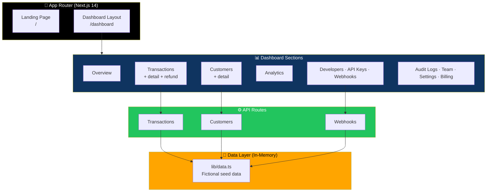

# 💳 PayFlow

<div align="center">


**A fictional FinTech payments platform built as a portfolio project.**

*Real Next.js App Router project · Real routes · Real API endpoints · Sandbox data only*

[✨ Overview](#-overview) • [🚀 Getting Started](#-getting-started) • [🏗️ Structure](#-project-structure) • [🎨 Theming](#-customizing-the-theme) • [🔒 Sandbox Mode](#-notes-on-sandbox-mode)

</div>

---

## 📖 Overview

**PayFlow** is a fully functional, production-shaped FinTech dashboard — built with **Next.js 14 App Router**, **TypeScript**, and **Tailwind CSS** — running entirely on sandbox/demo data.

This is not a mockup. Every page is a real route. Every button calls a real API handler. Every chart is a real chart.

### What Makes It Safe to Explore

> **No real payment processing. No real credentials. No real personal data anywhere in the codebase.**
>
> The refund button works. The webhook retry works. But nothing is persisted and no money moves — everything lives in memory, on purpose.

### Core Idea

> **A real FinTech product surface, running on fictional data.**
>
> Perfect for demonstrating Next.js App Router patterns, dashboard design, and API route structure — without the compliance overhead.

---

## 🚀 Getting Started

### Install & Run

```bash
npm install
npm run dev
```

Then open **[http://localhost:3000](http://localhost:3000)**.

### What You'll Find

| Route | Purpose |
|-------|---------|
| **`/`** | Marketing landing page |
| **`/dashboard`** | The authenticated app |

### Inside `/dashboard`

| Section | Purpose |
|---------|---------|
| **Overview** | High-level metrics and charts |
| **Payments** | Payment flows and status |
| **Transactions** | List + detail + refund action |
| **Customers** | List + detail |
| **Analytics** | Charts and reporting |
| **Developers** | Developer tools |
| **API Keys** | Key management UI |
| **Webhooks** | Webhook management + retry |
| **Audit Logs** | Activity trail |
| **Team** | Team member management |
| **Settings** | App configuration |
| **Billing** | Subscription and billing UI |

---

## 🏗️ Project Structure

```
app/
  page.tsx                 landing page
  layout.tsx               root layout + providers
  api/                     real route handlers (transactions, customers, webhooks)
  dashboard/
    layout.tsx             sidebar shell
    page.tsx               overview
    transactions/          list + [id] detail + refund action
    customers/             list + [id] detail
    payments/ analytics/ developers/ api-keys/ webhooks/
    audit-logs/ team/ settings/ billing/
components/
  marketing/               landing page sections
  dashboard/               sidebar, topbar, stat card, charts
  ui/                      shared design-system primitives
  theme-provider.tsx / theme-toggle.tsx
lib/
  data.ts                  sandbox/demo data + accessors
  utils.ts                 cn() className helper
types/
  index.ts                 shared TypeScript types
```

### Architecture Diagram



### Tech Stack

| Layer | Technology |
|-------|-----------|
| **Framework** | Next.js 14 (App Router) |
| **Language** | TypeScript |
| **Styling** | Tailwind CSS with a custom design-token theme |
| **Theming** | Light / dark via CSS variables |
| **Charts** | Recharts |
| **Icons** | lucide-react |
| **UI Primitives** | Hand-rolled in `components/ui` |
| **State** | In-memory sandbox data |

### UI Primitives

Hand-rolled in **`components/ui`** — written in the spirit of shadcn/ui:

- Button
- Card
- Badge
- Table
- Modal
- Toast
- Skeleton
- EmptyState
- Input

> 💡 **Swap in real shadcn components later** with `npx shadcn@latest add <component>` once you have network access.

---

## 🔒 Notes on "Sandbox Mode"

This is important to understand before you explore.

| Aspect | Reality |
|--------|---------|
| **All data in `lib/data.ts`** | ✅ **Fictional** |
| **Refund button** (`/dashboard/transactions/[id]`) | ✅ Calls a real API route — but the route only **simulates a status change in memory** |
| **Webhook retry button** | ✅ Same — simulates in memory |
| **Persistence** | ❌ **Nothing is persisted** |
| **Money movement** | ❌ **No money moves** |
| **Database** | ❌ **No database wired up** |
| **Authentication** | ❌ **No auth wired up** |

### If You Want to Make This a Real Product

The natural next steps are:

1. **Add a database** — e.g. Postgres via [Prisma](https://www.prisma.io/) or [Drizzle](https://orm.drizzle.team/)
2. **Add auth** — e.g. [NextAuth](https://next-auth.js.org/) or [Clerk](https://clerk.com/)
3. **Swap sandbox payment logic for a real processor's API** — e.g. [Stripe](https://stripe.com/) **in test mode**

---

## 🎨 Customizing the Theme

Colors live as **CSS variables** in `app/globals.css`:

- **`:root`** — light theme
- **`.dark`** — dark theme

They're mapped to **Tailwind utilities** in `tailwind.config.ts`:

- `bg-accent`
- `text-muted`
- `border-border`
- *(and the rest)*

> 💡 **Change the variable values to re-theme the whole app** — no component changes required.

### Design Tokens

```css
/* app/globals.css — simplified example */
:root {
  --background: ...;
  --foreground: ...;
  --accent: ...;
  --muted: ...;
  --border: ...;
  /* ... */
}

.dark {
  --background: ...;
  --foreground: ...;
  --accent: ...;
  --muted: ...;
  --border: ...;
}
```

Every component consumes these tokens through Tailwind classes — so a single edit cascades everywhere.

---

## 🗺️ Roadmap

### ✅ Current

- [x] Next.js 14 App Router with real routes
- [x] Real API route handlers (transactions, customers, webhooks)
- [x] Full dashboard with 12+ sections
- [x] Marketing landing page
- [x] Recharts-powered analytics
- [x] Hand-rolled UI primitives (Button, Card, Badge, Table, Modal, Toast, Skeleton, EmptyState, Input)
- [x] Light and dark themes via CSS variables
- [x] Refund action with real API call (simulated in memory)
- [x] Webhook retry action with real API call (simulated in memory)
- [x] Transaction and customer detail pages
- [x] Audit log, team, settings, and billing UIs
- [x] Fictional seed data throughout

### 🔜 Future Ideas

- [ ] Swap in real shadcn/ui components
- [ ] Add Postgres + Prisma or Drizzle
- [ ] Add NextAuth or Clerk for authentication
- [ ] Wire up Stripe in test mode
- [ ] Persist refunds and webhook retries
- [ ] Add Playwright E2E tests
- [ ] Add role-based access control for the Team section
- [ ] Real webhook signature verification demo
- [ ] Exportable audit log (CSV / JSON)

---

## 🤝 Contributing

Contributions are welcome. Please:

1. Fork the repository
2. **Keep it sandbox-safe** — no real credentials, no real payment calls
3. **Keep UI primitives consistent** — extend `components/ui`, don't duplicate
4. **Use design tokens** — never hard-code colors
5. Submit a Pull Request

### Guidelines

- **Never commit real credentials or API keys** — not even in test mode
- **Never call a real payment processor** — always simulate in memory
- **Never add real personal data** — keep the seed data fictional
- **Preserve the App Router structure** — pages belong in `app/`, primitives in `components/`
- **Preserve the theming system** — new colors go in CSS variables, not Tailwind overrides

---

## 📜 License

MIT — see [LICENSE](LICENSE) for details.

---

## 🙏 Acknowledgments

- **shadcn/ui** — for the design-system spirit this project borrows
- **Recharts** — for charts that just work
- **lucide-react** — for icons that feel intentional
- **Every FinTech dashboard that made you feel like you understood payments** — this is for you

---

<div align="center">

### 💳 REAL ROUTES. REAL API. FICTIONAL DATA.

**A production-shaped FinTech dashboard, safe to explore.**

**No real payments. No real credentials. No real personal data.**

<br>

⭐ If this project helped you, consider giving it a star.

<br>

[⬆ Back to Top](#-payflow)

</div>
